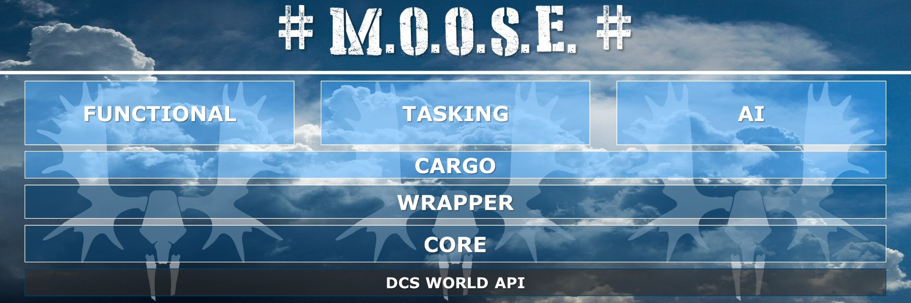

# MOOSE Developers Guide

MOOSE contains a lot of classes that can be used to enhance your missions.

Each section has an overview explanation on the different classes that mission designers can use to design compelling simulation scenarios.
It provides a short explanation of the concepts and its features, as well as important information to know in order to understand how to use the classes.
For more detailed information on the class, you will be guided to more detailed documentation on each individual class.

Click on one of the next section links below to open the guides for each of the major areas that are covered by MOOSE.

## 1. [MOOSE AI Classes](Moose_AI.html)

AI classes take control over the AI and makes the AI perform various processes.  
Some very complicated and enhanced classes are implemented to take control of AI.
It uses the AI to create for you an enhanced simulation experience for your players.

**Apply the AI classes to create a truly dynamic defense and attack system driven by AI.**

## 2. [MOOSE Tasking Classes](Moose_Tasking.html)

Tasking classes provide a comprehensive Mission Orchestration System for human players.
Command Centers govern multiple missions to achieve a mission goal.
Within each mission, various tasks are defined, which can be assigned to human players.
Upon completion of each task, a mission goal can be achieved, which will result in score points.

**Join the forces and apply the tasking classes to create a truly dynamic co-operative combat scenario.**

## 3. [MOOSE Cargo Classes](Moose_Cargo.html)

Cargo classes provide enhanced means to handle cargo transportation.
Cargo requires a bit more explanation. MOOSE has implemented **a separate system for cargo handling**.
It combines the capabilities of DCS world to combine infantry groups, cargo static objects and static objects
as "cargo" objects.
It also provides you with **AI cargo transportation** classes, 
and **Tasking classes for human players**, to transport cargo as part of a mission goal.
In order to use these MOOSE cargo facilities, you'll have to declare those groups and static objects
in a special way within your scripts and/or within the mission editor.
It is not a rocket science, but requires a bit of reading to trying to learn this new method.
Once you've learned this, a new world will open :-)

**Add the cargo capabilities, so that your mission scenarios are dynamically managing the combat resources.**

## 4. [MOOSE Functional Classes](Moose_Functional.html)

MOOSE functional classes provide various functions that are useful in mission design.
These classes vary and enhance the functionality of your simulation scenario.

**Apply various functional classes, to enhance the functionality in your mission scenarios.**

## 5. [MOOSE Wrapper Classes](Moose_Wrappers.html)

MOOSE wrapper classes provide an object oriented hierarchical mechanism to manage the DCS objects within the simulator.
Wrapper classes provide a greatly enhanced functionality to control groups, units, statics, scenery, airbases etc.

**Make life easy and use the wrapper classes to take control of individual DCS world objects.**

## 6. [MOOSE Core Classes](Moose_Core.html)

MOOSE core classes define the base building blocks of the MOOSE framework. 
The core classes utilize the DCS world core capability and greatly enhance its functionality.
It also provides new mechanisms that provide you with new tools to create your simulation scenarios.
Some of these methods are schedulers, event handlers, menu refreshing, enhanced messaging, sound, flags etc.

**Learn and understand the different core classes, if you want to develop or enhance your mission scenarios.**

